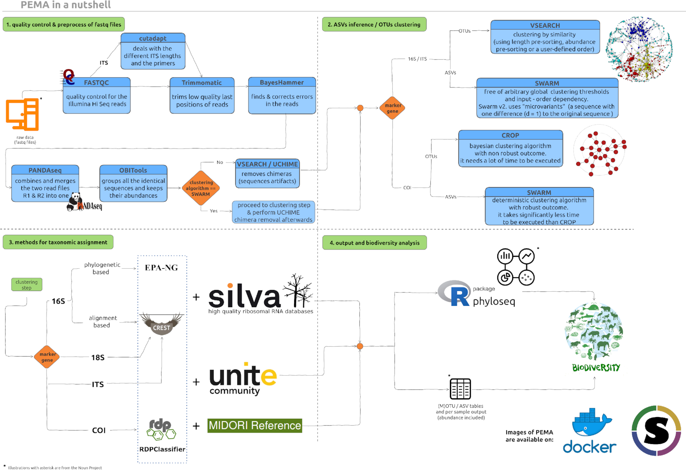

To run PEMA you need either [Docker](https://www.docker.com/) or [Singularity](https://sylabs.io/docs/) on your computer environment. 

Singularity is the best choice especially when you are running on a HPC or a cloud environment. 

For more details on how to set Docker or/and Singularity, please check on the [Running on HPC](https://hariszaf.github.io/pema_documentation/running_on_HPC/) and [Running on a personal computer]() according to your machine. 

Once you have a virtualization environment set, you need to build the input directory for PEMA. Once this is ready, you will need to *mount* this directory from you local, physical machine into the container environment to allow PEMA to run. 

Here are the steps to do so! 

----------------------------


## Step 1: Get PEMA on your computer environment

Being containerized, PEMA is extremely easy to be ready-to-go on your machine. 

You just need a single command according to the virtualization platform you are using: 

### Docker 
You just need to **pull** the PEMA image of the version (this will be the `<tag>` on the following commands) you want. 

```
docker pull hariszaf/pema:<tag>
```
If you leave `<tag>` blank, then you will automatically download the latest PEMA version. 

In case, you would like to get a specific PEMA version, let's say `v.1.3.2` for example, you just replace `<tag>` with the version

```
docker pull hariszaf/pema:v.1.3.1
```

As PEMA is a rather large image, this will take some minutes, depending on your internet connection. 


Once the download is complete, you are ready to go!

### Singularity

Singularity has exactly the same notion on how to **pull** a container. 

So, in this case, the command you will have to run is

```
singularity pull shub://hariszaf/pema:<tag>
```

Again, by leaving the `<tag>` blank you will get the latest PEMA version. 

For your information, the Singularity PEMA image is of smaller size. 

--------------------------------------

## Step 2: Prepare for running PEMA

Let us call the directory about to mount into the PEMA container `my_analysis`. 

PEMA needs two **madatory** input entries that **must** be included in the `my_analysis` directory: 

* a `mydata` folder including **only** the paired-end `.fastq.gz` files. If there is any README file there you need to **remove it** otherwise PEMA will return an error.

* the `parameters.tsv` file


Optionally, you might also include: 
* a `metadata.csv` file
* a `phyloseq_in_PEMA.R` script
* a `custom_ref_db` folder 

according to the needs of your analysis. 

> Here are some hints and tips about the aforementioned input data. 


### The `mydata` directory

The *name* of this file needs to be **always** as shown!
Otherwise, PEMA will return you an error.

You need to provide **paired-end `.fastq.gz` files**. Notice that your files need to be compressed. 

Furthermore, your files **have to be 

It is essential for PEMA to keep the names of the aforementioned folders and files **exactly** as they are. 

Furthermore, your files need to follow a certain format; the ENA format.

What does that mean to you? 

In the `parameters.tsv` file (see below for more) there is an option called `EnaData`. 

If your samples are already in the [ENA database](https://www.ebi.ac.uk/ena/browser/home) and you are using sequence files from there you might set this parameter to `Yes` and you are ready to go. 

Otherwise, and most likely, you need to make sure that the filenames of your sequence files have the **exact** following suffixes: 
* forward read:   `_R1_001.fastq.gz`
* reverese reads: `_R2_001.fastq.gz`

Then, you need to set the `EnaData` parameter to `No` and PEMA will make a convertion to your files and it will return a directory called `initial_data` with your own data and a `mapping_files_for_PEMA.tsv` with the new names of the files PEMA built and their corresponding names from your data.
 

### The `parameters.tsv` file

Like in the case of the `mydata` folder, the `parameters.tsv` file needs to **always keep its name like that**. 

> This file is rather important as it allows you to ask for PEMA exactly what you need. You may run several runs to tune the parameters included there to get the best results possible. 

In each PEMA version it is quite possible that new parameters have been added so a good practice is to always get the corresponding `parameters.tsv` file from the PEMA GitHub repo. 

As there is a great number of parameters you will be asked to fill, it is always a good practice to check on the documentation of each algorithm you are about to choose. Links to these documentation pages can be found in the `parameters.tsv` file.  


For further infromation regarding each marker gene, you may have a look on the corresponding documentation files. 

<br />

Here is an overview of the PEMA modules.

<br />



<br />

### The `phyloseq_in_PEMA.R` script

This scirpt is an optional input file for the case that you want to run any analyses after getting the final table with the taxonomy assigned sequences and their relative abundance in each sample.

You may find this script on the [PEMA GitHub repository](https://github.com/hariszaf/pema/blob/master/analysis_directory/phyloseq_in_PEMA.R) however, as you will notice, this script has several sections. 

Section 0 and section 1 need to be always as in the script on the repo. 
However, you may change the rest sections as suit you best! 
In the script we provide we have included some basics analyses, however you need to remember that some of those are strongly related to the `metadata.csv` file (see below), so you will have to change these parts accordingly. 

You may remove analyses or add any other feauture from the `phyloseq` package you would like to. You may have a look on the features of `phyloseq` over [here](https://vaulot.github.io/tutorials/Phyloseq_tutorial.html#data) or find any similar tutorial on Google.


### The `metadata.csv` file

Like in all previous cases, this file needs to be always called like that. You may find such a file on the [PEMA GitHub repo](https://github.com/hariszaf/pema/blob/master/analysis_directory/metadata.csv) as a prototype to build your own. 

You may provide as much metadata as you need for the `phyloseq` analysis part. 


### The `custom_ref_db` folder

Since `v.2.0.1` PEMA supports taxonomy assignment based on custom referernce databases. 

This module, can be quite grumpy so you may check the [Training the CREST classifier
](https://hariszaf.github.io/pema_documentation/training_crest_classifier/) if you are using 16/18S rRNA or ITS data and [Training the RDPClassifier
](https://hariszaf.github.io/pema_documentation/training_rdpclassifier/) for the COI acase, tabs to guide you through this task. 

Like in all aforementioned input files or/and directories, you **always** have to **call this directory exactly as mentioned** above. 

The names of the files you provide inside the `custom_ref_db` folder may be anything as long as they have the required suffixes, i.e `.fasta` and `.tsv` for the case of the RDPClassifier and `.fasta` and `.nds` for the CREST algorithm.


--------------------------------------

## Step 3: Running PEMA

Once your `analysis_directory` is ready, you may proceed on running PEMA. Actually, you have already done your part and now it's just a single command or a simple submission script if you're working on a HPC environment (see for more on [PEMA on HPC](https://hariszaf.github.io/pema_documentation/running_on_HPC/)).

In any case, running PEMA is a single command, depending on the virtualization platform you are using, exactly like the downloading task. 

So, you just need to *mount* your `analysis_directory` and then ask PEMA to run. 

### Docker

You just need to replace the `<path_to_your>` with the path where you `analysis_directory` is located and the `<tag>` with the PEMA version you are using. 

```
docker run \
--rm \
-it \
-v /<path_to_your>/analysis_directory/:/mnt/analysis hariszaf/pema:<tag>
```

### Singularity 

Like in the Docker version, you need to replace the `<path_to_your>` part with the path where you `analysis_directory` is located and the `<tag>` accordingly. 

```
singularity run \
-B /<path_to_your>/analysis_directory/:/mnt/analysis \
/<path_to>/pema_v.1.3.2.sif
```

### Take advantage of the checkpoints!

As you may need to partially re-run your analysis, PEMA supports that thanks to **checkpoints** built after each step. Checkpoints are also made in case an error occurs. 

To run a checkpoint, assuming by changing your taxonomy assignment parameters, you just need to run 

```
docker exec \
-v /<path_to_your>/analysis_directory/:/mnt/analysis \
/home/tools/BDS/.bds/bds -r /mnt/analysis/taxonomyAssignment.chp
```

or 

```
singularity exec \
-B /<path_of_your>/analysis_directory:/mnt/analysis pema_v.1.3.1.sif \
/home/tools/BDS/.bds/bds -r /mnt/analysis/taxonomyAssignment.chp
```

--------------------------------------

## Step 4: PEMA output

In the `parameters.tsv` file you are asked to provide PEMA with a name for your analysis that will be used to build a directory where all the PEMA output will be found. 

In all cases PEMA returns 7 subdirectories no matter. If a `phyloseq` analysis has been asked then PEMA builds an extra directory for that. 

Here is a short description of the output files PEMA returns.

### Pre-processing steps

In folders `1.quality_control`, `2.trimmomatic_output`, `3.correct_by_BayesHammer`, `4.merged_by_SPAdes`, `5.dereplicate_by_obiuniq` and `6.linearized_files` the output of each of tool used for the pre-processing steps are placed. 


In the first file the sequence quality control results are located. In this folder, there is a folder for each sample, as well as an `.html` file and a `.zip` file which contain all the information included in the folder with the sample’s output. The sequences of each sample, could get either a “pass”, “warn” or “fail” to each of FASTQC’s tests. 

The folder called “6.linearized_files” contains sample files (.fasta) only with the sequences that remained after the quality control and the pre-processing steps. These files are used to form a single .fasta (“final_all_samples.fasta”). That is the file PEMA will use from this point onwards for the clustering and taxonomy assignment steps.


These files can be considered as intermediate files.


### 7.gene_dependent

In this folder, all output from clustering and taxonomy assignment steps is placed. 


<!--

* ### gene_16S

The OTUs (Operational Taxonomic Unit) defined by the VSEARCH clustering algorithm, can be found in the “16S_all_samples.otus.fa” file. 

The file “16S_otutab.txt” is the OTU-table that includes the OTUs found and the number of the copies observed in each sample. No taxonomic information is included yet.

Τhere is also a folder called **16S_taxon_assign** (this name is the by default name of that folder, the user can change it in case of repeated runs) where the output of the **alignment-based taxonomy assignment** step is placed.

The *“Relative_Abundance.tsv”* file contains relative abundance values across the dataset, that are normalised to the total number of assigned reads.

The number of assignments at each taxonomic rank is provided in *“All_Assignments.tsv”*. Assignments to the taxon node itself are counted only. For each taxon, the full taxonomic path is provided.

In *“All_Cumulative.tsv”* file, cumulative counts for each taxonomic rank are listed. Here, assignments to child taxa are counted too.

The total counts of OTUs for each taxon can be found in *“Richness.tsv”*. 

Finally, ***“16S_otutab.txt”*** is the OTU-table that PEMA ends up with. The OTU-table contains all information about how OTUs are distributed, and hence it contains the taxonomic composition across each sample of the dataset.


If **phylogeny-based taxonomy approach** has also been performed, another folder called **16S_taxon_assign_phylogeny_assignment** has been created;  two output files are included in this folder: the “epa_info.log” which includes all parameters as they were set in EPA-ng and the “epa_result.jplace” file which is the final output of this approach and can be used as an input to a series of different tools (e.g. iTOL) in order to visualize the assignments of the OTUs found to the reference tree of 1000 taxa.


**Attention!**
<br/>
For the phylogeny-based taxonomy assignment, an MSA will be made with both the reference sequences and the query sequences; the final file will contain only the alignment of the query sequences as it ensued. The reference sequences are removed automatically from the final MSA by PEMA which subsequently executes the “convertPhylipToFasta.sh” (which is located in the folder *scripts* of PEMA) manually written program, to convert this final MSA from phylip (.phy) to Fasta (.fasta) format. 

Finally, EPA-ng is performed using the MSA file (“papara_alignment.fasta”, located in the *gene_16S* folder) along with the reference MSA (“raxml_easy_right_refmsa.raxml.reduced.phy.fasta”) and the reference tree (“raxml_easy_right_refmsa.raxml.bestTree”). The last two files, can be found here: *PEMA/tools/silva_132/for_placement/createTreeTheEasyWay*


* ### gene_COI

For the COI marker gene, there are two clustering algorithms provided by PEMA but only one taxonomy assignment method. Depending on the chosen clustering algorithm, a subfolder is created in it. Let us assume that the clustering method chosen by the user, was the Swarm clustering algorithm. Then a subfolder in the *7.gene_dependent* folder is created called as the clustering algorithm chosen; in our case *"SWARM"**. 

The file “SWARM_otu_no_chimera.fasta” contains all the MOTUs found.

As SWARM does the clustering and then the chimera removal takes place, in this file only the true MOTU sequences are included. Contrary, MOTU representatives are included in the “SWARM_final_OTU_representative.fasta” .

SWARM also produces two files “.stats” and “.swarms”. The first one is a tab-separated table with one MOTU per row and 8 columns of information, while  the MOTUs are written in the “.swarms” file. In fact, each line of this file, contains as much MOTUs as it is mentioned in the first column of the “.stats” file.

Finally, for the alignment-based taxonomy assignment that is used in the case of the COI marker gene, CREST - LCAClassifier and the MIDORI database, are used and you can find the output of each of the tools used for the pre-processing of the reads.

In the ***tax_assign_swarm_COI.txt*** file, the user can find the final MOTU-table. All MOTUs, are assigned to the species level; each MOTU has a taxonomy assigned and next to each taxon level, the confidence estimate that the MOTU belongs to that taxon is reported. However, the final MOTU-table for the case of the COI marker gene, is not made by the *“tax_assign_swarm_COI.txt”* file, but after a pre-process on that, during which only the assignments that have more than 97% confidence estimate to the MIDORI taxa, are kept. The final MOTU-table is the ***OTU_table_for_significantly_assigned.tsv*** file, where the user can see the taxonomies found with certainty and the samples in which they were recorded.


-->