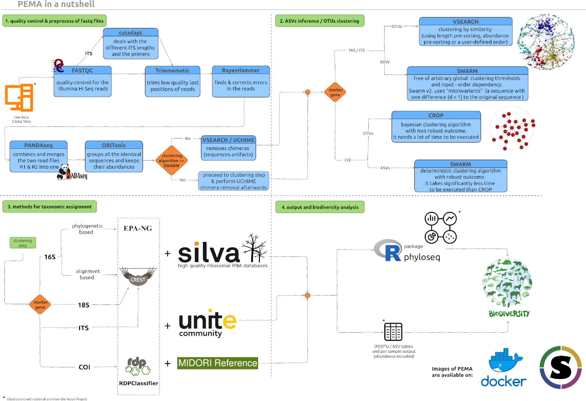

## Step 1: Prepare for running PEMA

Let us call the directory about to mount into the PEMA container `my_analysis`. 

PEMA needs two **madatory** input entries that **must** be included in the `my_analysis` directory: 

* a `mydata` folder including **only** the paired-end `.fastq.gz` files. If there is any README file there you need to **remove it** otherwise PEMA will return an error.

* the `parameters.tsv` file


Optionally, you might also include: 
* a `metadata.csv` file
* a `phyloseq_in_PEMA.R` script
* a `custom_ref_db` folder 

according to the needs of your analysis. 

> Here are some hints & tips about the aforementioned input data. 


### The `mydata` directory

The *name* of this file needs to be **always** as shown!
Otherwise, PEMA will return you an error.

You need to provide **paired-end `.fastq.gz` files**. Notice that your files need to be compressed. 

Furthermore, your files **have to be 

It is essential for PEMA to keep the names of the aforementioned folders and files **exactly** as they are. 

Furthermore, your files need to follow a certain format; the ENA format.

What does that mean to you? 

In the `parameters.tsv` file (see below for more) there is an option called `EnaData`. 

If your samples are already in the [ENA database](https://www.ebi.ac.uk/ena/browser/home) and you are using sequence files from there you might set this parameter to `Yes` and you are ready to go. 

Otherwise, and most likely, you need to make sure that the filenames of your sequence files have the **exact** following suffixes: 
* forward read:   `_R1_001.fastq.gz`
* reverese reads: `_R2_001.fastq.gz`

Then, you need to set the `EnaData` parameter to `No` and PEMA will make a convertion to your files and it will return a directory called `initial_data` with your own data and a `mapping_files_for_PEMA.tsv` with the new names of the files PEMA built and their corresponding names from your data.
 

### The `parameters.tsv` file

Like in the case of the `mydata` folder, the `parameters.tsv` file needs to **always keep its name like that**. 

> This file is rather important as it allows you to ask for PEMA exactly what you need. You may run several runs to tune the parameters included there to get the best results possible. 

In each PEMA version it is quite possible that new parameters have been added so a good practice is to always get the corresponding `parameters.tsv` file from the PEMA GitHub repo. 

As there is a great number of parameters you will be asked to fill, it is always a good practice to check on the documentation of each algorithm you are about to choose. Links to these documentation pages can be found in the `parameters.tsv` file.  


For further infromation regarding each marker gene, you may have a look on the corresponding documentation files. 

<br />

Here is an overview of the PEMA modules.

<br />



<br />


### The `phyloseq_in_PEMA.R` script

This scirpt is an optional input file for the case that you want to run any analyses after getting the final table with the taxonomy assigned sequences and their relative abundance in each sample.

You may find this script on the [PEMA GitHub repository](https://github.com/hariszaf/pema/blob/master/analysis_directory/phyloseq_in_PEMA.R) however, as you will notice, this script has several sections. 

Section 0 and section 1 need to be always as in the script on the repo. 
However, you may change the rest sections as suit you best! 
In the script we provide we have included some basics analyses, however you need to remember that some of those are strongly related to the `metadata.csv` file (see below), so you will have to change these parts accordingly. 

You may remove analyses or add any other feauture from the `phyloseq` package you would like to. You may have a look on the features of `phyloseq` over [here](https://vaulot.github.io/tutorials/Phyloseq_tutorial.html#data) or find any similar tutorial on Google.


### The `metadata.csv` file

Like in all previous cases, this file needs to be always called like that. You may find such a file on the [PEMA GitHub repo](https://github.com/hariszaf/pema/blob/master/analysis_directory/metadata.csv) as a prototype to build your own. 

You may provide as much metadata as you need for the `phyloseq` analysis part. 


### The `custom_ref_db` folder

Since `v.2.0.1` PEMA supports taxonomy assignment based on custom referernce databases. 

This module, can be quite grumpy so you may check the [Training the CREST classifier
](https://hariszaf.github.io/pema_documentation/training_crest_classifier/) if you are using 16/18S rRNA or ITS data and [Training the RDPClassifier
](https://hariszaf.github.io/pema_documentation/training_rdpclassifier/) for the COI acase, tabs to guide you through this task. 

Like in all aforementioned input files or/and directories, you **always** have to **call this directory exactly as mentioned** above. 

The names of the files you provide inside the `custom_ref_db` folder may be anything as long as they have the required suffixes, i.e `.fasta` and `.tsv` for the case of the RDPClassifier and `.fasta` and `.nds` for the CREST algorithm.


## Step 2: Running PEMA

Once your `analysis_directory` is ready, you may proceed on running PEMA. Actually, you have already done your part and now it's just a single command or a simple submission script if you're working on a HPC environment (see for more on [PEMA on HPC](https://hariszaf.github.io/pema_documentation/running_on_HPC/)).

In any case, running PEMA is a single command, depending on the virtualization platform you are using, exactly like the downloading task. 

So, you just need to *mount* your `analysis_directory` and then ask PEMA to run. 

### Docker

You just need to replace the `<path_to_your>` with the path where you `analysis_directory` is located and the `<tag>` with the PEMA version you are using. 

```
docker run \
--rm \
-it \
-v /<path_to_your>/analysis_directory/:/mnt/analysis 
hariszaf/pema:<tag>
```

### Singularity 

Like in the Docker version, you need to replace the `<path_to_your>` part with the path where you `analysis_directory` is located and the `<tag>` accordingly. 

```
singularity run \
-B /<path_to_your>/analysis_directory/:/mnt/analysis \
/<path_to>/pema_v.1.3.2.sif
```

### Take advantage of the checkpoints!

As you may need to partially re-run your analysis, PEMA supports that thanks to **checkpoints** built after each step. Checkpoints are also made in case an error occurs. 

To run a checkpoint, assuming by changing your taxonomy assignment parameters, you just need to run 

```
docker exec \
-v /<path_to_your>/analysis_directory/:/mnt/analysis \
/home/tools/BDS/.bds/bds -r /mnt/analysis/taxonomyAssignment.chp
```

or 

```
singularity exec \
-B /<path_of_your>/analysis_directory:/mnt/analysis pema_v.1.3.1.sif \
/home/tools/BDS/.bds/bds -r /mnt/analysis/taxonomyAssignment.chp
```


