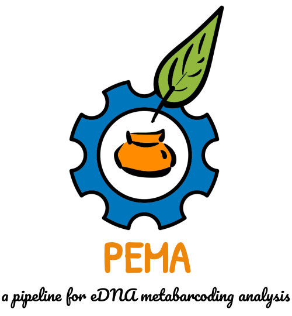
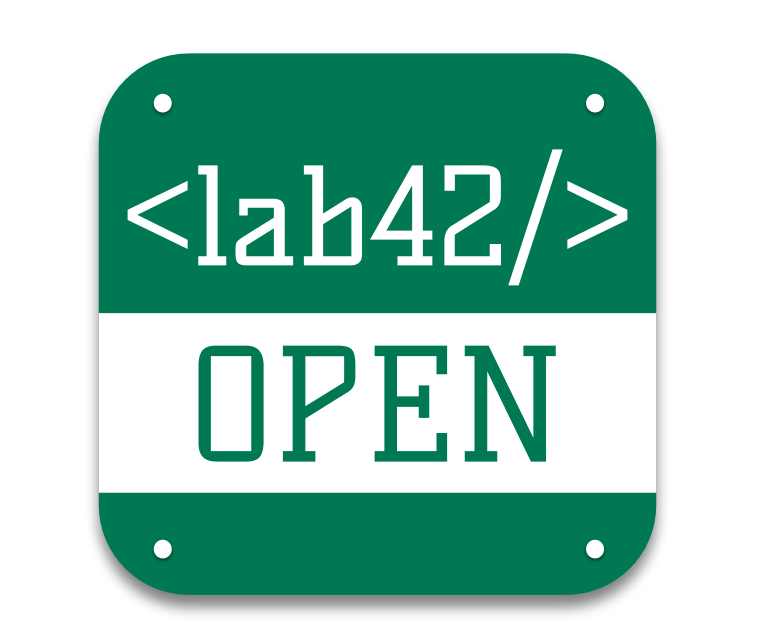

# Welcome

  Hey there!  
  This is the PEMA main site for <i>how to use</i> and further metabarcoding tips and hints!  
  

You may find PEMA as a [Docker](https://hub.docker.com/r/hariszaf/pema) and as a [Singularity](https://singularity-hub.org/collections/2295) container.

Here is the [PEMA GitHub repository](https://github.com/hariszaf/pema) if you want to have a look on the source code and why not, to [contribute](https://github.com/hariszaf/pema/blob/master/CONTRIBUTING.md) to!

> For any running issues you may have, or for any further features you would like to see included on PEMA, you can reach us through the [PEMA Gitter community](https://gitter.im/pema-helpdesk/community#)

Thanks for your interest on PEMA!
Keep metabarcoding!

The PEMA team

<table><tr>
  <td><a href="https://https://www.hcmr.gr/en/"> 
  <td><a href="http://imbbc.hcmr.gr/"> 
  <td><a href= "https://http://prego.hcmr.gr/">
  <td><a href="https://www.elidek.gr/en/homepage/">
  <td><a href="http://www.gsrt.gr/central.aspx?sId=119I428I1089I323I488743">
  <td><a href="https://reconnect.hcmr.gr/">
