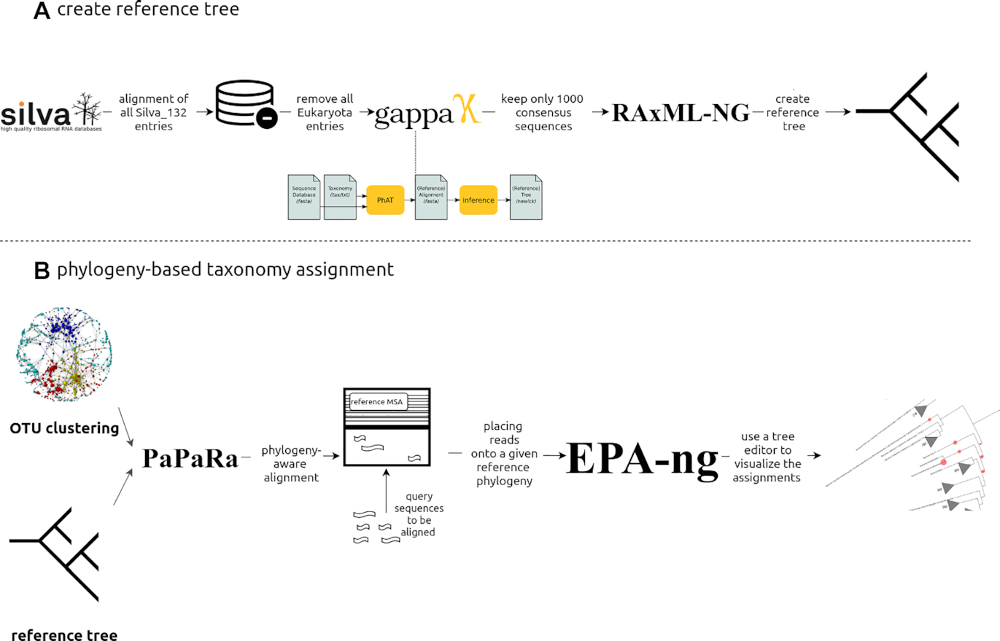

PEMA supports multiple options for running 16S or/and 18S rRNA data.

## Clustering OTUs / ASVs inference

You may choose between OTUs clustering or ASVs inference ;PEMA supports both. 

On the `parameters.tsv` file, you will find the `clusteringAlgoFor16S_18SrRNA` parameter. By setting this as `algo_vsearch` PEMA will use the [vsearch](https://github.com/torognes/vsearch) algorithm to get OTUs. 

Otherwise, by setting this as `algo_swarm` PEMA implements the [swarm](https://github.com/torognes/swarm) algorithm to infer ASVs.

## Silva version 128 and 132

Silva includes two different Silva versions you may choose. 

Silva versions besides the increased number of available sequences, they may include different taxonomic frameworks. 

You may furhter check on that on the corresponding literature, for example [here](https://academic.oup.com/nar/article/42/D1/D643/1061236) or visit the [Silva database website](https://www.arb-silva.de/).

## Alignment or phylogeny based taxonomy assignment

For the taxonomy assignment step, PEMA supports two ways when it comes to 16S/18S rRNA data. 

By setting `taxonomyAssignmentMethod` as `alignment`, PEMA will use the [CREST](https://github.com/lanzen/CREST) algorithm and the Silva version you selected and will return you an **alignment based** taxonomy assignment. 

On the contrary, by setting this parameter as `phylogeny` PEMA will use a reference tree of 1.000 consensus taxa we have built by using Silva 128, the RAxML-ng and the EPA algorithms to return you a **phylogeny based** taxonomy assignment which you will be able to view via tools such as iTOL.

Here is the workflow we used to build PEMA's reference tree. 

## `phyloseq` analysis

You may ask for PEMA to move on after the taxonomy step and run a `phyloseq` analysis. [Phyloseq](https://joey711.github.io/phyloseq/index.html) is a R package for further exploring microbiome profiles. 

To do so, you need to set the `phyloseq` parameter in the `parameters.tsv` file as `Yes` and add the `phyloseq_in_PEMA.R` script in the `analysis_directory` with all the rest of your input~ 

You may get a version of this script [here](https://github.com/hariszaf/pema/blob/master/analysis_directory/phyloseq_in_PEMA.R). As mentioned on the script, the first sections need to be **exactly like this**. 

However, you may add or remove `phyloseq` modules according to your needs. 

You always need to remember the `metadata.csv` file, you may find an example [here](https://github.com/hariszaf/pema/blob/master/analysis_directory/metadata.csv).

You need to add your own metadata there keeping the format of the file as it is!

> **You always have to keep the names of these scripts exactly as they are, otherwise PEMA will return you an error!**

Plots and all the phyloseq-related output will be saved in a seperate subdirectory called `phyloseq_output`. 